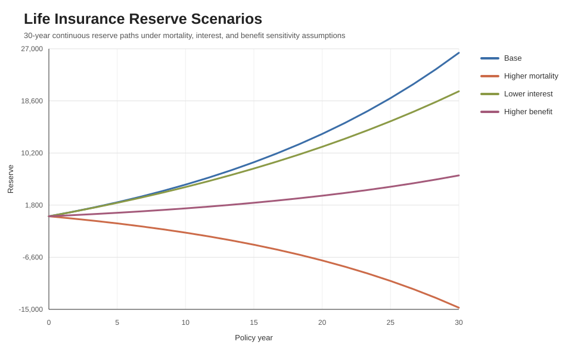
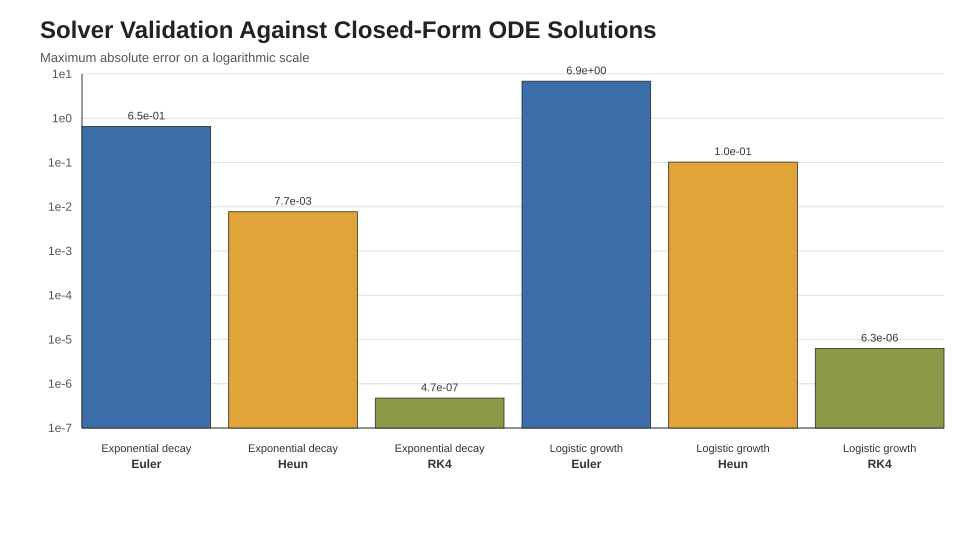

# Actuarial ODE Reserve Engine

Actuarial life reserve modeling with numerical ODE solvers, validation against closed-form equations, and scenario analysis for mortality, interest, and benefit assumptions.

This project turns a general ODE solver idea into an actuarial application: estimating policy reserves with Thiele's differential equation and comparing solver behavior across Euler, Heun, and fourth-order Runge-Kutta methods.

## Project Focus

- Build reusable Python implementations of Euler, Heun, and RK4 methods.
- Validate solver accuracy using ODEs with known closed-form solutions.
- Apply the solver interface to a simplified continuous life insurance reserve model.
- Compare reserve paths under actuarial and financial assumption changes.
- Export CSV outputs and chart figures for review.

## Actuarial Model

The reserve model uses a simplified continuous form of Thiele's differential equation:

```text
dV/dt = delta * V + P - mu * (B - V)
```

Where:

- `V` is the policy reserve.
- `delta` is the force of interest.
- `P` is the annual premium rate.
- `mu` is the mortality intensity.
- `B` is the death benefit.

This is intentionally simplified for portfolio demonstration. It is meant to show actuarial modeling logic, numerical methods, and scenario testing rather than serve as production pricing software.

## Sample Results

### Reserve Scenario Analysis



The scenario analysis compares a base reserve path against higher mortality, lower interest, and higher benefit assumptions. This helps illustrate how actuarial and financial assumptions affect reserve adequacy over a 30-year horizon.

### Solver Validation



The solver validation checks Euler, Heun, and RK4 against exponential decay and logistic growth models with known analytic solutions.

## Repository Structure

```text
.
|-- life_reserve_model.py
|-- figures/
|   |-- life_reserve_scenarios.svg
|   `-- solver_validation.svg
|-- requirements.txt
`-- README.md
```

## How to Run

```bash
python3 life_reserve_model.py
```

The script regenerates the CSV outputs in `outputs/` and chart figures in `figures/`.

## Skills Demonstrated

- Python actuarial modeling
- Numerical methods for ODEs
- Life contingency reserve logic
- Scenario and sensitivity analysis
- Model validation against theoretical solutions
- Data visualization and CSV reporting

## Credit

This public portfolio project extends ideas from a collaborative ODE engine originally developed with Wenxuan Ding. This version focuses on actuarial applications and uses an independent, recruiter-friendly implementation for public demonstration.

## Resume Bullet

```text
Extended a collaborative Python ODE engine into an actuarial reserve modeling project using Thiele's differential equation, validating Euler, Heun, and RK4 methods against closed-form solutions and visualizing reserve sensitivity to mortality, interest-rate, and benefit assumptions.
```
